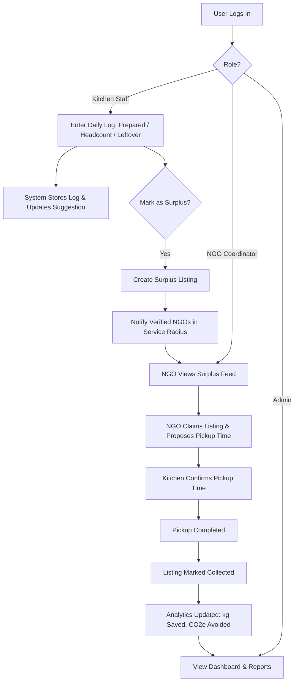
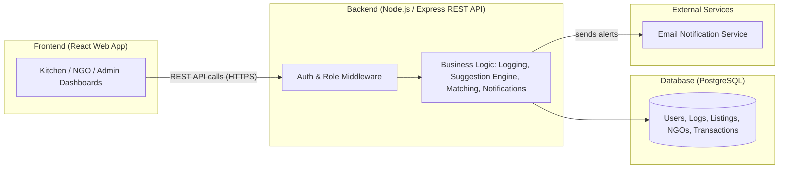
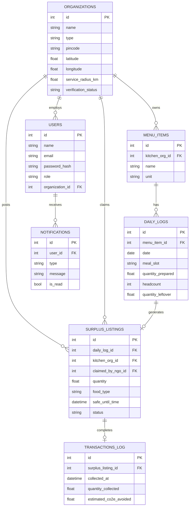

# Product Requirements Document (PRD)
## FoodShare AI — Smart Food Waste Reduction & Redistribution Platform

---

## Table of Contents

1. [Document Overview](#1-document-overview)
2. [Executive Summary](#2-executive-summary)
3. [Problem Statement](#3-problem-statement)
4. [Background and Context](#4-background-and-context)
5. [Goals and Objectives](#5-goals-and-objectives)
6. [Target Users / Stakeholders](#6-target-users--stakeholders)
7. [User Personas](#7-user-personas)
8. [Existing System](#8-existing-system)
9. [Proposed Solution](#9-proposed-solution)
10. [Scope](#10-scope)
11. [Functional Requirements](#11-functional-requirements)
12. [User Stories](#12-user-stories)
13. [Use Cases](#13-use-cases)
14. [Feature Requirements](#14-feature-requirements)
15. [Business Rules](#15-business-rules)
16. [Non-Functional Requirements](#16-non-functional-requirements)
17. [System Workflow](#17-system-workflow)
18. [System Architecture](#18-system-architecture)
19. [Technology Stack](#19-technology-stack)
20. [Database Requirements](#20-database-requirements)
21. [API Requirements](#21-api-requirements)
22. [UI/UX Requirements](#22-uiux-requirements)
23. [Authentication and Authorization](#23-authentication-and-authorization)
24. [Validation and Error Handling](#24-validation-and-error-handling)
25. [Reporting / Analytics](#25-reporting--analytics)
26. [Notifications](#26-notifications)
27. [AI/ML Requirements](#27-aiml-requirements)
28. [Security Requirements](#28-security-requirements)
29. [Assumptions and Constraints](#29-assumptions-and-constraints)
30. [Risks and Mitigation](#30-risks-and-mitigation)
31. [Success Metrics](#31-success-metrics)
32. [MVP Definition](#32-mvp-definition)
33. [Future Enhancements](#33-future-enhancements)
34. [Implementation Roadmap](#34-implementation-roadmap)
35. [Testing Requirements](#35-testing-requirements)
36. [Acceptance Criteria](#36-acceptance-criteria)
37. [Traceability Matrix](#37-traceability-matrix)
38. [Glossary](#38-glossary)
39. [Final Recommended Project Structure](#39-final-recommended-project-structure)
40. [One-Page Project Summary](#one-page-project-summary)

---

## 1. Document Overview

| Field | Detail |
|---|---|
| **Project Name** | FoodShare AI — Smart Food Waste Reduction & Redistribution Platform |
| **Version** | 1.0 |
| **Date** | September 15, 2026 |
| **Document Purpose** | To define the functional, technical, and design requirements for a student-implementable software platform that reduces food waste in institutional kitchens and enables surplus food redistribution, in response to the MoFPI problem statement (Ref: 26234). |
| **Target Audience** | Project mentor/evaluator, student development team, UI/UX designer, database designer |
| **Project Type** | College major/minor project — Web-based Software Application (Software category, Agriculture/FoodTech & Rural Development theme) |

---

## 2. Executive Summary

**What it is:** FoodShare AI is a web-based platform that helps institutional kitchens (college/office canteens, hostels, catering units, hospitals) track food preparation and surplus, predict how much food will be needed on a given day, flag food nearing expiry, and connect leftover/surplus food with nearby NGOs, food banks, and shelters for pickup.

**Problem it solves:** Institutional kitchens routinely over-produce food because planning is based on guesswork rather than data. Surplus food is thrown away instead of being redirected to people who need it, because there is no simple, organized channel connecting kitchens to receiving organizations.

**Who will use it:** Kitchen/canteen managers and staff, NGO/food bank coordinators, and an institutional administrator who oversees waste and sustainability reporting.

**Why it is needed:** Manual, paper-based, or WhatsApp-group-based surplus coordination is slow, unreliable, and untracked. A structured digital platform makes surplus visible in real time, matches it to nearby receivers, and produces the data institutions need for sustainability reporting.

**Expected outcome:** A working web application (MVP) that lets a kitchen log daily meal preparation and leftovers, receive simple AI-based next-day demand predictions from historical data, post surplus food listings, and let NGOs claim and arrange pickup — along with a dashboard showing waste trends and estimated environmental impact.

---

## 3. Problem Statement

Institutional kitchens and food processing units — including college canteens, hostel messes, office cafeterias, catering services, and food processing plants — routinely produce more food than is consumed, largely because planning decisions are based on manual estimates rather than historical consumption data. As a result, large quantities of edible food are discarded daily.

At the same time, there is no structured, real-time mechanism connecting these kitchens with nearby NGOs, food banks, shelters, and community kitchens that could use this surplus food before it spoils. Existing coordination, where it exists at all, happens through informal phone calls or messaging groups, which are slow, undocumented, and easy to miss.

There is a need for a digital platform that helps institutional kitchens (a) plan food preparation more accurately using their own historical data, (b) identify and flag surplus or soon-to-expire food promptly, and (c) connect that surplus with verified nearby receiving organizations in a fast, trackable, and organized way — while also giving the institution visibility into how much waste it is preventing over time.

---

## 4. Background and Context

### Current Situation
Institutional kitchens prepare food based on the personal judgment of the kitchen manager or chef, informed by rough headcounts and past experience. There is no systematic record of how much food was cooked versus how much was actually consumed on a given day.

### Existing Process/System
- Preparation quantities are decided manually, often the same amount every day regardless of actual attendance/demand.
- Leftover food, if not consumed, is either discarded, informally offered to staff, or occasionally handed to whichever NGO happens to be reachable by phone that day.
- No written record of waste quantity, cause, or value is maintained.
- There is no shared, searchable list of NGOs/receivers near the institution, and no way for an NGO to know surplus is available without someone remembering to call them.

### Problems with the Current Approach
- Overproduction is not measured or corrected over time (no feedback loop).
- Surplus is often discovered too late for safe redistribution.
- Redistribution depends on personal contacts and luck rather than a repeatable process.
- No data exists to report waste-reduction progress to management or for ESG/sustainability compliance.

### Why the Proposed System Is Needed
A lightweight digital system that records preparation vs. consumption data, surfaces simple demand trends, and gives kitchens a one-click way to post surplus to a pool of registered nearby NGOs would directly address the gaps above — without requiring expensive hardware or infrastructure.

---

## 5. Goals and Objectives

### Primary Goal
Build a web platform that reduces food waste in institutional kitchens by improving preparation planning and enabling fast, trackable redistribution of surplus food to nearby NGOs/food banks.

### Objectives
1. Allow kitchen staff to log daily meal preparation, headcount, and leftover quantities in under 2 minutes per entry.
2. Provide a data-driven "suggested preparation quantity" for the next day based on the kitchen's own historical logs.
3. Allow surplus food to be posted and visible to relevant NGOs within 5 minutes of entry.
4. Allow an NGO to claim a surplus listing and confirm a pickup time through the platform.
5. Flag items nearing their entered expiry/use-by time so staff can act before spoilage.
6. Provide a dashboard showing waste trends (kg saved, meals redirected, estimated CO₂e avoided) over selectable time periods.
7. Maintain a verified directory of NGOs/food banks/shelters with service area and contact details.
8. Ensure the system is usable by non-technical kitchen staff with minimal training (≤15-minute onboarding).

---

## 6. Target Users / Stakeholders

| Stakeholder/User | Role | Needs | Main Interaction |
|---|---|---|---|
| Kitchen/Canteen Staff | Logs daily preparation, consumption, and surplus | Fast entry, clear next-day suggestions, simple surplus posting | Daily log entry, surplus posting screen |
| Kitchen/Institution Manager (Admin) | Oversees kitchen operations, views reports | Waste trends, cost-saving insights, ESG reports | Dashboard, reports, user management |
| NGO/Food Bank Coordinator | Claims and collects surplus food | Real-time visibility of nearby surplus, reliable pickup scheduling | Surplus listing feed, claim & pickup confirmation |
| NGO Organization Admin | Manages NGO profile and coordinator accounts | Accurate profile, service area, verified status | NGO registration & profile management |
| System Administrator | Maintains platform, verifies NGOs, manages users | Platform stability, fraud/abuse prevention | Admin panel, verification queue |
| Delivery/Volunteer (optional) | Transports surplus food from kitchen to NGO | Pickup details, address, contact | Pickup task view (Should Have, not MVP-critical) |

---

## 7. User Personas

**Persona 1 — Ramesh, Canteen Supervisor**
- Background: Manages a college canteen kitchen, 15 years of cooking experience, moderate smartphone comfort.
- Goals: Reduce food thrown away at end of day; avoid running short on food.
- Pain points: No time for complicated software; currently guesses quantities.
- Expected usage: Logs prep quantity and leftovers each evening on a tablet/phone; checks next-day suggestion each morning.

**Persona 2 — Priya, NGO Coordinator**
- Background: Coordinates food collection for a local shelter serving ~80 people daily.
- Goals: Get reliable, timely alerts when surplus food is available nearby; avoid wasted trips.
- Pain points: Currently relies on random phone calls; often finds out too late.
- Expected usage: Checks the surplus feed on her phone through the day; claims listings and updates pickup status.

**Persona 3 — Dr. Anjali Mehta, Institution Administrator**
- Background: Oversees sustainability/ESG reporting for the institution.
- Goals: Quantify waste reduction and demonstrate social impact for compliance reports.
- Pain points: No consolidated data currently exists on food waste.
- Expected usage: Logs in monthly to view/download dashboard reports and export data.

---

## 8. Existing System

**Assumption:** No prior digital system exists at the target institutions; coordination is entirely manual (paper logs, verbal instructions, and phone/WhatsApp-based NGO contact), as implied by the problem statement's description of the current landscape.

- **How the problem is currently handled:** Kitchen managers estimate quantities from memory/experience; leftovers are either discarded or handed off informally if a contact happens to be reachable.
- **Existing tools/processes:** Paper registers (if any) for stock/purchase, not for demand vs. actual consumption; personal phone contacts for NGOs.
- **Limitations:** No historical data to learn from; no guaranteed redistribution channel; no reporting.
- **Pain points:** Wasted food, wasted money, missed opportunity to help vulnerable populations, no audit trail for sustainability reporting.

---

## 9. Proposed Solution

### Core Concept
A web application with two connected sides: a **Kitchen side** (log preparation/consumption, get next-day suggestions, post surplus) and an **NGO side** (browse/claim nearby surplus, confirm pickup) — tied together by an **Admin side** for verification and platform-wide reporting.

### How It Works
1. Kitchen staff log daily prepared quantity, estimated headcount/attendance, and end-of-day leftover quantity per meal/menu item.
2. The system stores this history and, using a simple statistical/ML forecasting method (e.g., moving average or basic regression on past logs), suggests a preparation quantity for the next occurrence of that meal.
3. When staff record leftover food, they can mark it as **Surplus Available** with quantity, food type, prepared time, and a safe-to-consume-until time.
4. The system notifies NGOs registered within the kitchen's configured service radius.
5. An NGO coordinator claims the listing and confirms a pickup time; the kitchen sees the claim and pickup status in real time.
6. Once marked "Collected" (by kitchen or NGO), the transaction is logged for reporting: meals saved, kg redirected, and an estimated CO₂e-avoided figure using a standard conversion factor.
7. Admins verify NGO registrations, manage users, and view institution-wide/aggregate reports.

### Major Components
- Daily Log module (prep/consumption/leftover entry)
- Demand Prediction module (historical trend-based suggestion)
- Surplus Listing & Redistribution module
- NGO Directory & Verification module
- Notification module (in-app + email)
- Analytics & Reporting Dashboard module
- User & Role Management module

### User Interaction
Kitchen staff and NGO coordinators interact through a responsive web app (desktop or mobile browser); no native mobile app is required for MVP.

### Expected Benefits
- Reduced daily food waste through better-informed preparation quantities.
- Faster, trackable surplus redistribution instead of ad-hoc calls.
- Documented sustainability metrics for institutional reporting.
- Improved food access for NGOs/shelters through reliable surplus visibility.

---

## 10. Scope

### In Scope
- Web application with role-based access (Kitchen Staff, Kitchen Admin, NGO Coordinator, NGO Admin, System Admin).
- Daily preparation/consumption/leftover logging per menu item.
- Historical-data-based next-day preparation suggestion (simple statistical model).
- Manual expiry/use-by time entry with automatic near-expiry alerts (rule-based, time-threshold driven).
- Surplus food listing, NGO claim, and pickup status tracking.
- NGO directory with registration and admin verification workflow.
- Distance-based matching of surplus listings to NGOs within a configurable service radius (using stored coordinates/pincode — not live GPS tracking).
- In-app and email notifications for surplus posted, claimed, and near-expiry alerts.
- Analytics dashboard: waste trend charts, kg saved, meals redirected, estimated CO₂e avoided, exportable as PDF/Excel.
- Admin panel for user, NGO, and platform management.

### Out of Scope (for current version)
- IoT hardware sensors (temperature/weight/spoilage sensors) — replaced by manual data entry.
- Computer-vision-based automatic food quality/image assessment — replaced by manual expiry-time entry (listed as a possible future enhancement).
- Real-time GPS-based live route optimization/logistics — replaced by simple static distance/radius matching.
- Payments or financial transactions between kitchens and secondary buyers.
- Integration with food processing plant machinery/production-line monitoring (overproduction, downtime, energy-use sensors).
- Native mobile applications (iOS/Android) — MVP is a responsive web app only.
- Multi-language support (assumption: English only for MVP).

---

## 11. Functional Requirements

### Module: Authentication & User Management
**Purpose:** Control access to the platform based on role.
**Users:** All user types.

| Requirement ID | Requirement | Priority | Description |
|---|---|---|---|
| FR-01 | User Registration | High | Users can register with name, email, password, organization, and role (Kitchen Staff/NGO Coordinator). |
| FR-02 | User Login | High | Registered users can log in with email and password using a secure session/token. |
| FR-03 | Role-Based Access | High | System restricts screens/actions based on assigned role. |
| FR-04 | Password Reset | Medium | Users can reset a forgotten password via email link. |
| FR-05 | NGO Verification | High | System Admin must approve NGO registrations before they can view/claim surplus listings. |

### Module: Daily Log & Demand Prediction
**Purpose:** Capture preparation/consumption data and suggest next-day quantities.
**Users:** Kitchen Staff, Kitchen Admin.

| Requirement ID | Requirement | Priority | Description |
|---|---|---|---|
| FR-06 | Add Daily Log Entry | High | Staff can log menu item, quantity prepared, estimated headcount, and date/meal slot. |
| FR-07 | Record Leftover Quantity | High | Staff can enter leftover quantity at the end of a meal slot. |
| FR-08 | View Preparation History | Medium | Staff/Admin can view past logs for a menu item, filterable by date range. |
| FR-09 | Generate Next-Day Suggestion | High | System calculates a suggested preparation quantity from the last N logs of the same menu item/day-of-week. |
| FR-10 | Edit/Delete Log Entry | Low | Staff can correct same-day entries before day-end lock. |

### Module: Surplus Listing & Redistribution
**Purpose:** Convert leftover food into an actionable, claimable listing.
**Users:** Kitchen Staff, NGO Coordinator.

| Requirement ID | Requirement | Priority | Description |
|---|---|---|---|
| FR-11 | Create Surplus Listing | High | Staff can mark a leftover entry as surplus, entering quantity, food type, prepared time, and safe-until time. |
| FR-12 | View Nearby Surplus Feed | High | NGO Coordinators see active listings from kitchens within their configured service radius. |
| FR-13 | Claim Surplus Listing | High | NGO Coordinator can claim an available listing, reserving it for their organization. |
| FR-14 | Confirm Pickup Time | High | NGO proposes a pickup time; kitchen can accept/adjust. |
| FR-15 | Mark Listing Collected | High | Kitchen or NGO marks a claimed listing as "Collected" to close the transaction. |
| FR-16 | Auto-Expire Listing | Medium | Listings past their safe-until time and uncollected are automatically marked "Expired." |
| FR-17 | Near-Expiry Alert | High | System flags leftover/prepared items approaching their entered safe-until time (rule-based threshold, e.g., 60 minutes before). |

### Module: NGO Directory
**Purpose:** Maintain verified list of receiving organizations.
**Users:** NGO Admin, System Admin.

| Requirement ID | Requirement | Priority | Description |
|---|---|---|---|
| FR-18 | NGO Profile Creation | High | NGO Admin creates an organization profile with name, address/pincode, service radius, and contact details. |
| FR-19 | NGO Verification Queue | High | System Admin reviews and approves/rejects pending NGO registrations. |
| FR-20 | NGO Directory Listing | Medium | Kitchen Admins can view a list of verified NGOs registered near their location. |

### Module: Analytics & Reporting
**Purpose:** Provide visibility into waste trends and impact.
**Users:** Kitchen Admin, System Admin.

| Requirement ID | Requirement | Priority | Description |
|---|---|---|---|
| FR-21 | Waste Trend Dashboard | High | Displays charts of quantity prepared vs. consumed vs. wasted over a selected date range. |
| FR-22 | Redistribution Summary | High | Shows total kg redirected, number of listings collected, and meals-equivalent saved. |
| FR-23 | Estimated Environmental Impact | Medium | Calculates estimated CO₂e avoided using a standard published emission factor per kg of food waste avoided. |
| FR-24 | Export Report | Medium | Reports/dashboard data exportable as PDF and Excel (CSV). |

### Module: Notifications
**Purpose:** Keep users informed of relevant events in near real time.
**Users:** All user types.

| Requirement ID | Requirement | Priority | Description |
|---|---|---|---|
| FR-25 | Surplus Posted Notification | High | NGOs in range receive an in-app/email notification when a new surplus listing is posted. |
| FR-26 | Claim Confirmation Notification | High | Kitchen staff are notified when a listing is claimed. |
| FR-27 | Near-Expiry Notification | High | Kitchen staff receive an alert for items nearing their safe-until time. |

---

## 12. User Stories

**US-01**
As a Kitchen Staff member, I want to log today's prepared quantity and headcount, so that the system can build a history for demand prediction.
*Priority: High*
**Acceptance Criteria**
- User can open the "Add Log Entry" form.
- Menu item, quantity, unit, and headcount are required fields.
- System prevents duplicate entries for the same item/meal slot/date.
- Successful submission shows a confirmation message and appears in the log list.

**US-02**
As a Kitchen Staff member, I want to see a suggested preparation quantity for tomorrow, so that I can reduce overproduction.
*Priority: High*
**Acceptance Criteria**
- Suggestion is shown on the dashboard for each recurring menu item.
- Suggestion is based on at least 3 historical entries; otherwise the system indicates "insufficient data."
- Suggestion updates automatically as new logs are added.

**US-03**
As a Kitchen Staff member, I want to post leftover food as a surplus listing, so that nearby NGOs can be notified.
*Priority: High*
**Acceptance Criteria**
- Form requires quantity, food type, and safe-until time.
- Listing appears instantly in the NGO feed for NGOs within range.
- Confirmation message is shown after posting.

**US-04**
As an NGO Coordinator, I want to view active surplus listings near my organization, so that I can decide what to collect.
*Priority: High*
**Acceptance Criteria**
- Feed shows only listings within the NGO's configured service radius.
- Listings show quantity, food type, kitchen location, and time remaining.
- Expired listings are automatically hidden from the active feed.

**US-05**
As an NGO Coordinator, I want to claim a listing and propose a pickup time, so that the kitchen knows to expect collection.
*Priority: High*
**Acceptance Criteria**
- Claiming a listing removes it from other NGOs' active feed.
- Kitchen receives a claim notification with proposed pickup time.
- Kitchen can accept or suggest an alternate time.

**US-06**
As a Kitchen Admin, I want to view a dashboard of waste trends, so that I can report progress to management.
*Priority: High*
**Acceptance Criteria**
- Dashboard shows prepared vs. consumed vs. wasted quantities by date range.
- Dashboard shows total kg redirected and estimated CO₂e avoided.
- Data can be exported as PDF/Excel.

**US-07**
As a System Admin, I want to verify NGO registrations, so that only legitimate organizations can claim food.
*Priority: High*
**Acceptance Criteria**
- Pending NGO registrations appear in a verification queue.
- Admin can approve or reject with a reason.
- Rejected/unverified NGOs cannot view or claim listings.

**US-08**
As a Kitchen Staff member, I want to receive an alert when a surplus item is nearing its safe-until time, so that I can act before it spoils.
*Priority: Medium*
**Acceptance Criteria**
- Alert triggers at a configurable threshold (e.g., 60 minutes) before safe-until time.
- Alert appears in-app and via email.
- Alert is dismissible once actioned.

---

## 13. Use Cases

| Use Case ID | Use Case | Actor | Preconditions | Main Flow | Postconditions |
|---|---|---|---|---|---|
| UC-01 | Log Daily Preparation | Kitchen Staff | User is logged in | User opens log form → enters menu item, quantity, headcount → submits | Log entry saved; history updated |
| UC-02 | View Next-Day Suggestion | Kitchen Staff/Admin | At least 3 historical logs exist | User opens dashboard → views suggested quantity per item | Suggestion displayed; no data change |
| UC-03 | Post Surplus Listing | Kitchen Staff | Leftover entry recorded | User marks leftover as surplus → enters safe-until time → submits | Listing created and visible to nearby NGOs |
| UC-04 | Claim Surplus Listing | NGO Coordinator | NGO is verified; listing is active | User views feed → selects listing → claims and proposes pickup time | Listing status changes to "Claimed"; kitchen notified |
| UC-05 | Confirm Pickup | Kitchen Staff | Listing is claimed | Staff reviews proposed time → accepts/adjusts | Pickup time confirmed; NGO notified |
| UC-06 | Mark Listing Collected | Kitchen Staff / NGO Coordinator | Listing is claimed and picked up | User marks listing "Collected" | Transaction closed; recorded in analytics |
| UC-07 | Verify NGO Registration | System Admin | NGO has submitted registration | Admin reviews profile → approves/rejects | NGO status updated; NGO notified |
| UC-08 | View Waste Dashboard | Kitchen Admin | Logs exist for selected date range | Admin selects date range → views charts → optionally exports | Report viewed/exported; no data change |

---

## 14. Feature Requirements

### Feature: Next-Day Preparation Suggestion
- **Description:** Suggests a preparation quantity for a menu item based on its own recent history.
- **Purpose:** Reduce overproduction by replacing guesswork with data.
- **User:** Kitchen Staff, Kitchen Admin.
- **Inputs:** Historical logs (quantity prepared, quantity consumed, date, day-of-week, meal slot) for the given menu item.
- **Processing:** Weighted moving average of the last N same-day-of-week entries (configurable N, default 4), adjusted by consumption ratio (consumed/prepared) trend.
- **Outputs:** A suggested quantity with a simple confidence indicator ("Based on 4 data points").
- **Validation:** Requires a minimum of 3 historical entries before a suggestion is shown.
- **Error Handling:** Displays "Insufficient data" message and default fallback if history is too short.
- **Dependencies:** Daily Log module.

### Feature: Surplus Listing & Matching
- **Description:** Lets kitchens post surplus and NGOs discover it by proximity.
- **Purpose:** Replace informal phone-based coordination with a trackable digital channel.
- **User:** Kitchen Staff, NGO Coordinator.
- **Inputs:** Quantity, food type, prepared time, safe-until time, kitchen location (pincode/coordinates).
- **Processing:** System calculates straight-line distance between kitchen and each verified NGO's registered location; filters listings shown to an NGO by its configured service radius.
- **Outputs:** Filtered, sorted (by distance/time-remaining) surplus feed per NGO.
- **Validation:** Safe-until time must be in the future; quantity must be greater than zero.
- **Error Handling:** Prevents claiming an already-claimed or expired listing; shows a clear error message.
- **Dependencies:** NGO Directory module, Notification module.

### Feature: Waste Analytics Dashboard
- **Description:** Visual summary of preparation, consumption, waste, and redistribution data.
- **Purpose:** Give institutions measurable insight into their waste-reduction progress.
- **User:** Kitchen Admin, System Admin.
- **Inputs:** Aggregated daily logs and completed surplus transactions.
- **Processing:** Aggregation queries by date range; CO₂e estimate = kg redirected × standard emission factor (assumption: published FAO/EPA-style factor, configurable).
- **Outputs:** Charts (line/bar), summary cards, exportable report file.
- **Validation:** Date range must be valid (start ≤ end).
- **Error Handling:** Shows "No data available for selected range" when applicable.
- **Dependencies:** Daily Log module, Surplus Listing module.

---

## 15. Business Rules

- Every user must belong to exactly one organization (kitchen or NGO) and one role.
- An NGO account cannot view or claim surplus listings until verified by a System Admin.
- A surplus listing can be claimed by only one NGO at a time (first-claim-wins).
- A listing automatically moves to "Expired" if not collected by its safe-until time.
- Daily log entries for a given menu item/meal slot/date cannot be duplicated; the system must prevent duplicate creation.
- Same-day log entries can be edited only until the meal slot's day-end lock (assumption: 11:59 PM the same day); after that they are read-only.
- Only Kitchen Admin and System Admin roles can view cross-date aggregate reports; Kitchen Staff can view only their own recent entries.
- CO₂e and "meals saved" figures are estimates based on configurable standard conversion factors, not measured emissions.
- Required fields (quantity, date, menu item, safe-until time where applicable) must be validated before submission is accepted.

---

## 16. Non-Functional Requirements

### Performance
- Pages should load within 3 seconds on a standard broadband/4G connection.
- The system should comfortably support at least 50 concurrent users and 10,000 log/listing records for a college-scale deployment without noticeable slowdown.

### Security
- Passwords stored using industry-standard hashing (e.g., bcrypt).
- Role-based authorization enforced on every protected API endpoint, not just hidden in the UI.
- All input fields validated and sanitized on both client and server sides.
- Sensitive data (credentials, tokens) never exposed in client-side logs or URLs.

### Usability
- Core actions (log entry, post surplus, claim listing) achievable in 3 clicks or fewer from the dashboard.
- Interface responsive across desktop and mobile browser widths.
- Error messages must be specific and in plain language (e.g., "Quantity must be greater than 0," not "Invalid input").

### Reliability
- Failed submissions must not silently lose user input; forms should retain entered data on validation failure.
- Listing status transitions (Available → Claimed → Collected/Expired) must be consistent and cannot skip states.

### Scalability
- Database schema designed so additional institutions/kitchens and NGOs can be onboarded without structural changes (multi-tenant-ready via organization ID on core tables).
- Backend built as a modular REST API so a future mobile app could reuse the same endpoints.

### Maintainability
- Code organized by feature module with consistent naming conventions.
- Key business logic (e.g., suggestion calculation, distance matching) isolated into well-documented, testable functions.
- README and inline documentation maintained for setup and each module.

---

## 17. System Workflow

**Simple step-by-step flow:**
1. User logs in → system authenticates and loads role-specific dashboard.
2. Kitchen Staff enters daily preparation/consumption/leftover data → backend stores it in the database.
3. Backend recalculates the next-day suggestion for that menu item using stored history.
4. If leftover is marked as surplus, backend creates a listing and identifies verified NGOs within the configured radius → sends notifications.
5. NGO Coordinator views the feed (fetched from backend) → claims a listing → backend updates listing status and notifies the kitchen.
6. Pickup occurs; either party marks the listing "Collected" → backend logs the transaction for analytics.
7. Kitchen Admin/System Admin views the dashboard → backend runs aggregation queries → returns chart data and summary metrics.



---

## 18. System Architecture

The architecture is kept intentionally simple: a single web application with a REST API backend, a relational database, and no external hardware dependency.



**Layer Notes:**
- **Frontend:** React single-page application, responsive design.
- **Backend:** Node.js/Express REST API handling authentication, business logic (suggestion engine, distance-based matching, notification triggers).
- **Database:** PostgreSQL (relational) — suits the structured, relationship-heavy data (users, organizations, logs, listings).
- **External services:** A transactional email service (e.g., a free-tier SMTP provider) only — no other third-party services required for MVP.
- **AI/ML component:** Lightweight statistical forecasting logic runs inside the backend (no separate ML infrastructure required) — see Section 27.

---

## 19. Technology Stack

| Layer | Recommended Technology | Reason |
|---|---|---|
| Frontend | React.js (with Tailwind CSS) | Free, widely taught, component-based, fast to build responsive UI |
| Backend | Node.js with Express.js | Free, JavaScript across stack reduces context-switching for a student team |
| Database | PostgreSQL | Free, relational, handles the structured relationships (users, NGOs, logs, listings) well |
| Authentication | JWT (JSON Web Tokens) + bcrypt for password hashing | Free, stateless, simple to implement and well documented |
| APIs | REST (JSON over HTTPS) | Simple, well-understood, easy to test with student-level tooling |
| Deployment | Render/Railway (backend + DB) and Vercel/Netlify (frontend) free tiers | Free-tier hosting suitable for a college project demo |

**Alternatives:** Backend could alternatively use Django + Django REST Framework (Python) if the team is more comfortable with Python; database could alternatively use MySQL. Either substitution does not change the architecture.

---

## 20. Database Requirements

| Table/Entity | Purpose | Important Fields |
|---|---|---|
| users | Stores all platform users | id, name, email, password_hash, role, organization_id |
| organizations | Stores kitchens and NGOs | id, name, type (kitchen/ngo), address, pincode, latitude, longitude, service_radius_km, verification_status |
| menu_items | Master list of recurring dishes per kitchen | id, kitchen_org_id, name, unit |
| daily_logs | Records prepared/consumed/leftover per item per day | id, menu_item_id, date, meal_slot, quantity_prepared, headcount, quantity_leftover, created_by |
| surplus_listings | Tracks posted surplus food | id, daily_log_id, kitchen_org_id, quantity, food_type, prepared_time, safe_until_time, status, claimed_by_ngo_id |
| notifications | Stores in-app notification records | id, user_id, type, message, is_read, created_at |
| transactions_log | Records completed collections for analytics | id, surplus_listing_id, collected_at, quantity_collected, estimated_co2e_avoided |

**Relationships:**
- `organizations.id` → referenced as a foreign key by `users.organization_id`, `menu_items.kitchen_org_id`, and `surplus_listings.kitchen_org_id` / `claimed_by_ngo_id`.
- `menu_items.id` → foreign key in `daily_logs.menu_item_id`.
- `daily_logs.id` → foreign key in `surplus_listings.daily_log_id`.
- `surplus_listings.id` → foreign key in `transactions_log.surplus_listing_id`.
- **Primary keys:** every table uses an auto-generated `id`.
- **Constraints:** `daily_logs` has a unique constraint on (`menu_item_id`, `date`, `meal_slot`) to prevent duplicate entries; `surplus_listings.status` is constrained to an enum (`Available`, `Claimed`, `Collected`, `Expired`).



---

## 21. API Requirements

| Method | Endpoint | Purpose | Request | Response |
|---|---|---|---|---|
| POST | /api/auth/register | Register a new user | name, email, password, role, organization_id | user object + token |
| POST | /api/auth/login | Authenticate user | email, password | token + user profile |
| POST | /api/logs | Create a daily log entry | menu_item_id, date, meal_slot, quantity_prepared, headcount | created log object |
| GET | /api/logs/:menuItemId/suggestion | Get next-day suggestion | menu_item_id (param) | suggested_quantity, confidence_note |
| PATCH | /api/logs/:id | Update leftover quantity / edit same-day entry | quantity_leftover | updated log object |
| POST | /api/listings | Create a surplus listing | daily_log_id, quantity, food_type, safe_until_time | created listing object |
| GET | /api/listings/feed | Get nearby active listings for an NGO | ngo_org_id (from token) | array of listings within radius |
| POST | /api/listings/:id/claim | Claim a listing | proposed_pickup_time | updated listing (status: Claimed) |
| PATCH | /api/listings/:id/collect | Mark a listing collected | quantity_collected | updated listing (status: Collected) + transaction record |
| GET | /api/ngos | List verified NGOs near a kitchen | kitchen_org_id | array of NGO org objects |
| PATCH | /api/ngos/:id/verify | Approve/reject NGO registration (Admin only) | verification_status | updated organization object |
| GET | /api/reports/dashboard | Get aggregated dashboard data | start_date, end_date, organization_id | charts data, totals, co2e_avoided |
| GET | /api/reports/export | Export dashboard as PDF/Excel | start_date, end_date, format | file download |

---

## 22. UI/UX Requirements

| Screen | User | Purpose | Major Components |
|---|---|---|---|
| Login / Register | All | Authenticate or create account | Form fields, role selector, validation messages |
| Kitchen Dashboard | Kitchen Staff/Admin | Overview of today's status and suggestions | Suggested quantity cards, quick "Add Log" button, recent activity list |
| Add/Edit Daily Log | Kitchen Staff | Enter prep/consumption/leftover data | Form with menu item dropdown, quantity, headcount fields |
| Post Surplus | Kitchen Staff | Convert leftover into a listing | Quantity, food type, safe-until time picker, submit button |
| NGO Surplus Feed | NGO Coordinator | Browse and claim nearby listings | List/cards sorted by distance & time remaining, claim button, filters |
| Claim/Pickup Detail | NGO Coordinator, Kitchen Staff | Confirm pickup logistics | Kitchen address/contact, proposed time, accept/adjust controls, status badge |
| NGO Directory | Kitchen Admin | View verified NGOs nearby | Searchable/filterable table, verification badge |
| Admin Verification Queue | System Admin | Approve/reject NGO registrations | Pending list, profile detail view, approve/reject buttons |
| Analytics Dashboard | Kitchen Admin, System Admin | View waste and impact trends | Date range picker, charts (line/bar), summary cards, export button |
| Notifications Panel | All | View recent alerts | List of notifications, read/unread indicator |

**Navigation:** Persistent top/side navigation bar showing role-appropriate menu items only.
**Forms:** All forms validate required fields inline before submission; disabled submit button until valid.
**Tables/grids:** Sortable columns for listings/logs where the list can exceed ~10 rows; pagination after 20 rows.
**Buttons:** Primary action (e.g., "Post Surplus," "Claim") visually distinct from secondary/cancel actions.
**Filters/search:** NGO feed filterable by distance and food type; log history filterable by date range and menu item.
**Notifications:** In-app bell icon with unread count; toast messages for immediate action confirmation.
**Validation messages:** Displayed inline, next to the relevant field, in plain language.
**Empty states:** "No surplus listings nearby right now" / "No logs yet — add your first entry" with a call-to-action button.
**Error states:** Clear message plus retry option for failed API calls (e.g., "Couldn't load listings. Try again").

---

## 23. Authentication and Authorization

- **Login requirements:** Email + password; JWT issued on successful login, stored client-side and sent with each API request.
- **User roles:** Kitchen Staff, Kitchen Admin, NGO Coordinator, NGO Admin, System Admin.
- **Permissions:** Enforced server-side on every endpoint based on role and organization ownership (e.g., a Kitchen Staff user can only edit logs belonging to their own organization).
- **Session/token handling:** JWT with a reasonable expiry (assumption: 24 hours), refreshed on login; expired tokens force re-login.
- **Access restrictions:** NGO accounts cannot access any kitchen-side log/suggestion screens; Kitchen accounts cannot access the NGO claim feed; only System Admin can access the verification queue and platform-wide user management.

**Role-Permission Matrix**

| Action | Kitchen Staff | Kitchen Admin | NGO Coordinator | NGO Admin | System Admin |
|---|---|---|---|---|---|
| Add/Edit Daily Log | ✅ | ✅ | ❌ | ❌ | ❌ |
| View Own Org Reports | ❌ | ✅ | ❌ | ❌ | ✅ |
| Post Surplus Listing | ✅ | ✅ | ❌ | ❌ | ❌ |
| View/Claim Surplus Feed | ❌ | ❌ | ✅ | ✅ | ❌ |
| Manage NGO Profile | ❌ | ❌ | ❌ | ✅ | ✅ |
| Verify NGO Registrations | ❌ | ❌ | ❌ | ❌ | ✅ |
| Manage All Users | ❌ | ❌ | ❌ | ❌ | ✅ |

---

## 24. Validation and Error Handling

- **Required-field validation:** Enforced both client-side (immediate feedback) and server-side (authoritative check) for all forms.
- **Invalid input:** Numeric fields reject non-numeric/negative values with a specific message (e.g., "Quantity must be a positive number").
- **Duplicate data:** System blocks duplicate daily log entries for the same menu item/meal slot/date; blocks duplicate NGO organization registrations by email/registration number.
- **Unauthorized access:** API returns HTTP 401/403 with a generic "You do not have permission to perform this action" message; frontend redirects unauthorized users to an appropriate screen.
- **Database errors:** Caught and logged server-side; user sees a generic "Something went wrong, please try again" message rather than raw error details.
- **API failures:** Frontend shows a retry option and does not lose already-entered form data.
- **Network failures:** Frontend detects failed requests (timeout) and displays an offline/connection-error banner.
- **Empty results:** Lists/dashboards show a friendly empty-state message rather than a blank screen (see Section 22).

---

## 25. Reporting / Analytics

Reporting is directly relevant to this project, since sustainability/ESG-style reporting is explicitly requested in the problem statement.

- **Reports:** Waste trend report (prepared vs. consumed vs. wasted), redistribution summary report, environmental impact estimate report.
- **Dashboard requirements:** Summary cards (total kg wasted, total kg redirected, meals-equivalent saved, estimated CO₂e avoided) plus a trend line/bar chart over the selected date range.
- **Filters:** Date range, menu item, meal slot.
- **KPIs:** Waste reduction % period-over-period, redistribution success rate (claimed & collected vs. posted), average time-to-claim.
- **Export options:** PDF (formatted summary) and Excel/CSV (raw aggregated data) export.

---

## 26. Notifications

| Notification | Trigger | Recipient |
|---|---|---|
| Surplus Posted | New surplus listing created | Verified NGOs within service radius |
| Listing Claimed | NGO claims a listing | Kitchen Staff who posted it |
| Pickup Confirmed | Kitchen confirms/adjusts pickup time | NGO Coordinator who claimed it |
| Near-Expiry Alert | Item approaching safe-until time threshold | Kitchen Staff |
| Listing Expired | Listing passes safe-until time uncollected | Kitchen Staff |
| NGO Verification Result | Admin approves/rejects NGO registration | NGO Admin |
| Password Reset | User requests password reset | Requesting user |

Notifications are delivered in-app (notification panel) and via email; no SMS/push notification system is included in MVP (kept out to avoid unnecessary complexity/cost).

---

## 27. AI/ML Requirements

**Why AI/ML is required:** The problem statement explicitly calls for AI-based demand/surplus prediction. For a student-implementable MVP, this is scoped down from a complex predictive model to a transparent, lightweight statistical forecasting method — genuinely useful without requiring a data science infrastructure.

- **Input data:** Each menu item's historical `daily_logs` records — quantity prepared, quantity consumed (prepared − leftover), date, day-of-week, meal slot.
- **Model/function:** A weighted moving average of the last N (default 4) same-day-of-week entries for that menu item, adjusted by the recent consumption ratio (consumed ÷ prepared) to nudge the suggestion down if consistent overproduction is detected. (Assumption: this simple, explainable statistical approach is used instead of a trained ML model, since a few dozen data points per kitchen is too little for reliable ML training — this keeps the feature realistic and implementable.)
- **Processing flow:** New log saved → backend recalculates the moving average and consumption ratio for that menu item → suggestion cached and served on next dashboard load.
- **Expected output:** A suggested next preparation quantity, shown with a simple confidence note (e.g., "Based on last 4 Mondays").
- **Evaluation metrics:** Mean Absolute Error (MAE) between suggested quantity and actual quantity consumed, tracked over time to show the suggestion is improving planning accuracy.
- **Limitations:** Works only after enough historical data accumulates (minimum 3 entries); does not account for one-off events (holidays, special functions) unless staff manually adjust; is a statistical heuristic, not a trained machine-learning model, and should be described as such in any project presentation.

**Near-expiry detection** is rule-based (time-threshold comparison), not AI/ML — this is clearly a simpler, appropriate technique and is described as such rather than being labelled "AI" for the sake of it.

---

## 28. Security Requirements

- Passwords hashed with bcrypt (or equivalent) before storage; never stored or logged in plain text.
- Role-based access control enforced on every backend API route.
- Parameterized queries/ORM usage to prevent SQL injection.
- All user input sanitized/escaped before storage and before rendering (prevents stored XSS).
- JWT tokens transmitted only over HTTPS; short expiry with re-authentication required after expiry.
- Rate limiting on login and registration endpoints to reduce brute-force/spam risk.
- Sensitive fields (passwords, tokens) excluded from API responses and application logs.
- File upload security (if profile images are added later): restrict file types/size and store outside the executable web root — **not required for MVP**, as no file uploads are in scope.

---

## 29. Assumptions and Constraints

### Assumptions
- No existing digital system is in place at target institutions (Section 8).
- IoT sensors and computer-vision quality assessment are replaced with manual data entry for MVP feasibility.
- Route/logistics optimization is replaced with simple straight-line distance + service-radius matching.
- Daily log entries can be edited only until end-of-day (11:59 PM) the same day.
- English-only interface for MVP.
- A standard, configurable published emission factor is used to estimate CO₂e avoided (not measured directly).
- JWT token expiry of 24 hours is acceptable for this use case.
- Email is the only external notification channel required (no SMS/push).

### Constraints
- **Budget:** Zero/near-zero budget — free-tier hosting and open-source tools only.
- **Development time:** Single academic semester (assumption: ~12–16 weeks).
- **Team size:** Small student team (assumption: 3–5 members).
- **Technology restrictions:** Must use free/open-source technologies (per instructions); no paid APIs or licensed software.
- **Hosting limitations:** Free-tier cloud hosting (e.g., Render/Vercel free tier), which may have cold-start delays and storage limits — acceptable for a demo-scale deployment.
- **Data availability:** No real historical institutional data is available at project start; seed/sample data will be used for development and demonstration.

---

## 30. Risks and Mitigation

| Risk | Probability | Impact | Mitigation |
|---|---|---|---|
| Insufficient historical data makes suggestions inaccurate early on | High | Medium | Clearly show "insufficient data" state; allow manual override of suggestions |
| NGOs slow to register/verify, leaving few active receivers for demo | Medium | Medium | Pre-seed demo NGO accounts; simplify verification for pilot phase |
| Free-tier hosting downtime/cold starts during evaluation | Medium | Medium | Test deployment ahead of demo; keep a local fallback build ready |
| Scope creep from stakeholders expecting IoT/computer vision features | Medium | High | Document scope clearly (Section 10); communicate MVP boundaries early to mentor |
| Duplicate/conflicting claims on the same surplus listing (race condition) | Low | Medium | Enforce atomic "first-claim-wins" update at the database level |
| Team member unfamiliarity with chosen stack slows development | Medium | Medium | Use well-documented, widely taught technologies (React/Node/PostgreSQL); allocate early learning time |
| Data privacy concerns with storing organization contact/location data | Low | Medium | Store only necessary fields; restrict access via role-based authorization |

---

## 31. Success Metrics

- **Suggestion accuracy:** Mean Absolute Error between suggested and actual consumed quantity decreases over the semester/pilot period.
- **Response time:** 95% of API requests respond within 1 second under normal load.
- **Redistribution success rate:** Percentage of posted surplus listings that reach "Collected" status (target: >70% during pilot).
- **Adoption:** Number of active kitchen and NGO accounts logging in weekly during the pilot period.
- **Waste reduction:** Percentage decrease in average leftover quantity per menu item after 4–6 weeks of using suggestions, compared to baseline.
- **System availability:** Uptime target of 99% during the evaluation/demo period.
- **Error reduction:** Decrease in duplicate/invalid log entries over time due to validation.

---

## 32. MVP Definition

### Must Have
- User registration/login with roles (Kitchen Staff, Kitchen Admin, NGO Coordinator, NGO Admin, System Admin).
- Daily log entry (prepared, headcount, leftover).
- Next-day suggestion based on historical logs.
- Post surplus listing, view nearby feed, claim, confirm pickup, mark collected.
- NGO registration and admin verification.
- Basic waste/redistribution dashboard with charts.
- Near-expiry alert notification.
- In-app + email notifications for core events.

### Should Have
- Report export (PDF/Excel).
- Filters/search on logs and NGO feed.
- Editable NGO service radius and profile details.

### Could Have
- Volunteer/delivery-agent role and pickup task assignment.
- Multi-language interface.
- Basic image upload for surplus listings (photo of food, not AI-analyzed).

### Won't Have in MVP
- IoT sensor integration.
- Computer-vision-based food quality assessment.
- Real-time GPS route optimization.
- Native mobile apps.
- Payment/secondary-buyer marketplace features.
- Food processing plant machinery/production-line monitoring.

---

## 33. Future Enhancements

- Integrate basic computer-vision-based expiry/quality checks from photos, once sufficient labeled data is available.
- Add live GPS tracking and route optimization for volunteer pickup/delivery.
- Build native mobile apps for kitchen staff and NGO coordinators.
- Extend the forecasting model to a proper time-series ML model once enough multi-season data has been collected.
- Add SMS/WhatsApp notification channel for regions with lower email usage.
- Support multiple languages for wider institutional adoption.
- Add a secondary-buyer marketplace for surplus that cannot be donated (e.g., near-expiry packaged goods).
- Expand analytics to include a food-processing-unit efficiency module (overproduction, downtime, energy use) if the platform is extended beyond kitchens.

---

## 34. Implementation Roadmap

| Phase | Major Deliverables |
|---|---|
| 1. Requirement Analysis | Finalized PRD (this document), confirmed scope and MVP boundary with mentor |
| 2. UI/UX Design | Wireframes/mockups for all screens listed in Section 22; role-based navigation design |
| 3. Database Design | Finalized ER diagram and schema (Section 20); sample/seed data prepared |
| 4. Backend Development | REST API implementation (Section 21), auth/role middleware, suggestion engine, matching logic |
| 5. Frontend Development | React screens built per UI/UX design, connected to API |
| 6. Integration | Frontend-backend integration, notification service wiring, end-to-end flow testing |
| 7. Testing | Unit, integration, functional, UI, and security testing (Section 35) |
| 8. Deployment | Backend/DB deployed to free-tier host, frontend deployed, environment variables secured |
| 9. Documentation | User guide, README, final project report, presentation deck |

---

## 35. Testing Requirements

- **Unit testing:** Individual functions (e.g., suggestion calculation, distance matching, validation rules) tested in isolation.
- **Integration testing:** API endpoints tested against the database (e.g., creating a log correctly updates the suggestion).
- **Functional testing:** End-to-end user flows (register → log → post surplus → claim → collect) verified against acceptance criteria.
- **UI testing:** Forms validate correctly; navigation restricted by role; responsive layout checked on common screen sizes.
- **Security testing:** Attempt unauthorized access to protected routes; attempt SQL injection/XSS payloads in form fields; verify password hashing.
- **User acceptance testing:** Mentor/evaluator or sample kitchen/NGO users walk through core flows and confirm they meet expectations.

**Sample Test Cases**

| Test ID | Feature | Test Scenario | Expected Result |
|---|---|---|---|
| TC-01 | Daily Log Entry | Submit log with negative quantity | System rejects with validation error |
| TC-02 | Daily Log Entry | Submit duplicate entry for same item/date/slot | System blocks duplicate and shows message |
| TC-03 | Suggestion Engine | Request suggestion with only 2 historical entries | System shows "insufficient data" |
| TC-04 | Surplus Listing | Two NGOs attempt to claim the same listing simultaneously | Only the first request succeeds; second sees "already claimed" |
| TC-05 | Surplus Listing | Listing passes safe-until time uncollected | Status auto-changes to "Expired" and disappears from feed |
| TC-06 | Authentication | Login with incorrect password | System denies access with generic error message |
| TC-07 | Authorization | NGO Coordinator attempts to access Kitchen log screen URL directly | System blocks access with 403 error |
| TC-08 | Dashboard | Select date range with no data | Dashboard shows empty-state message, not a blank/broken chart |

---

## 36. Acceptance Criteria

The system will be considered complete and acceptable when:
- All **Must Have** MVP features (Section 32) are implemented and pass functional testing.
- All High-priority functional requirements (Section 11) are implemented and traceable to a passing test case.
- Role-based access control correctly restricts every screen and API endpoint per the permission matrix (Section 23).
- The suggestion engine produces a suggestion once minimum historical data exists, and correctly shows "insufficient data" otherwise.
- The surplus listing lifecycle (Available → Claimed → Collected/Expired) behaves correctly with no invalid state transitions.
- The analytics dashboard correctly aggregates and displays data for a selected date range, with working export.
- The application is deployed and accessible via a public URL for demonstration.
- Core non-functional requirements (Section 16) — load time, basic security checks, responsive layout — are met.

---

## 37. Traceability Matrix

| Requirement ID | Feature | User Story | Test Case |
|---|---|---|---|
| FR-01 | User Registration | US (implicit — Auth) | TC-06 |
| FR-02 | User Login | US (implicit — Auth) | TC-06 |
| FR-05 | NGO Verification | US-07 | TC-07 |
| FR-06 | Add Daily Log Entry | US-01 | TC-01, TC-02 |
| FR-09 | Generate Next-Day Suggestion | US-02 | TC-03 |
| FR-11 | Create Surplus Listing | US-03 | TC-05 |
| FR-12 | View Nearby Surplus Feed | US-04 | TC-07 |
| FR-13 | Claim Surplus Listing | US-05 | TC-04 |
| FR-16 | Auto-Expire Listing | US-04 | TC-05 |
| FR-17 | Near-Expiry Alert | US-08 | TC-05 |
| FR-19 | NGO Verification Queue | US-07 | TC-07 |
| FR-21 | Waste Trend Dashboard | US-06 | TC-08 |
| FR-23 | Estimated Environmental Impact | US-06 | TC-08 |

---

## 38. Glossary

| Term | Meaning |
|---|---|
| Surplus Listing | A record of leftover food posted by a kitchen and made available for NGO pickup |
| Safe-Until Time | The time by which surplus food should be collected/consumed to remain safe |
| Service Radius | The maximum distance from an NGO's registered location within which it wants to see surplus listings |
| CO₂e | Carbon dioxide equivalent — a standardized unit for estimating greenhouse gas impact |
| MVP | Minimum Viable Product — the smallest feature set that delivers real value |
| MoSCoW | Prioritization method: Must have, Should have, Could have, Won't have |
| JWT | JSON Web Token — a compact token format used for authentication |
| ESG | Environmental, Social, and Governance — a framework for sustainability reporting |
| Moving Average | A forecasting technique that averages recent historical values to predict the next one |

---

## 39. Final Recommended Project Structure

```
foodshare-ai/
├── backend/
│   ├── src/
│   │   ├── config/            # DB connection, environment config
│   │   ├── models/            # ORM models: User, Organization, MenuItem, DailyLog, SurplusListing, Transaction, Notification
│   │   ├── routes/            # Express route definitions per module
│   │   ├── controllers/       # Request handlers per module
│   │   ├── services/          # Business logic: suggestionEngine.js, matchingService.js, notificationService.js
│   │   ├── middleware/        # auth.js, roleCheck.js, errorHandler.js, validators/
│   │   └── app.js
│   ├── tests/                 # Unit & integration tests
│   ├── package.json
│   └── .env.example
├── frontend/
│   ├── src/
│   │   ├── components/        # Reusable UI components
│   │   ├── pages/              # Login, KitchenDashboard, PostSurplus, NgoFeed, AdminPanel, Analytics
│   │   ├── services/           # API call wrappers
│   │   ├── context/             # Auth/role context
│   │   └── App.jsx
│   ├── public/
│   └── package.json
├── docs/
│   ├── PRD.md                  # This document
│   ├── ER-diagram.png
│   └── user-guide.md
└── README.md
```

---

## One-Page Project Summary

**Problem:** Institutional kitchens overproduce food due to guesswork-based planning, and edible surplus is discarded because there is no organized, trackable channel connecting kitchens to nearby NGOs and food banks.

**Proposed Solution:** FoodShare AI — a web platform where kitchen staff log daily preparation/consumption data, receive a data-driven next-day preparation suggestion, and post surplus leftovers as listings that verified nearby NGOs can claim and pick up, with an analytics dashboard tracking waste reduction and environmental impact.

**Main Users:** Kitchen Staff/Admin, NGO Coordinator/Admin, System Admin.

**Key Features:** Daily prep/consumption logging, historical-data-based demand suggestion, surplus posting & claiming workflow, NGO directory & verification, near-expiry alerts, waste/impact analytics dashboard, role-based access.

**Technology Stack:** React.js frontend, Node.js/Express REST API backend, PostgreSQL database, JWT-based authentication, free-tier hosting (Render/Vercel).

**Expected Outcome:** A working, deployable web application that measurably reduces institutional food waste and creates a reliable, documented redistribution channel — plus sustainability reporting data for the institution.

**MVP:** Role-based accounts, daily logging, next-day suggestion, surplus posting/claiming/collection workflow, NGO verification, near-expiry alerts, and a core waste/redistribution analytics dashboard.
